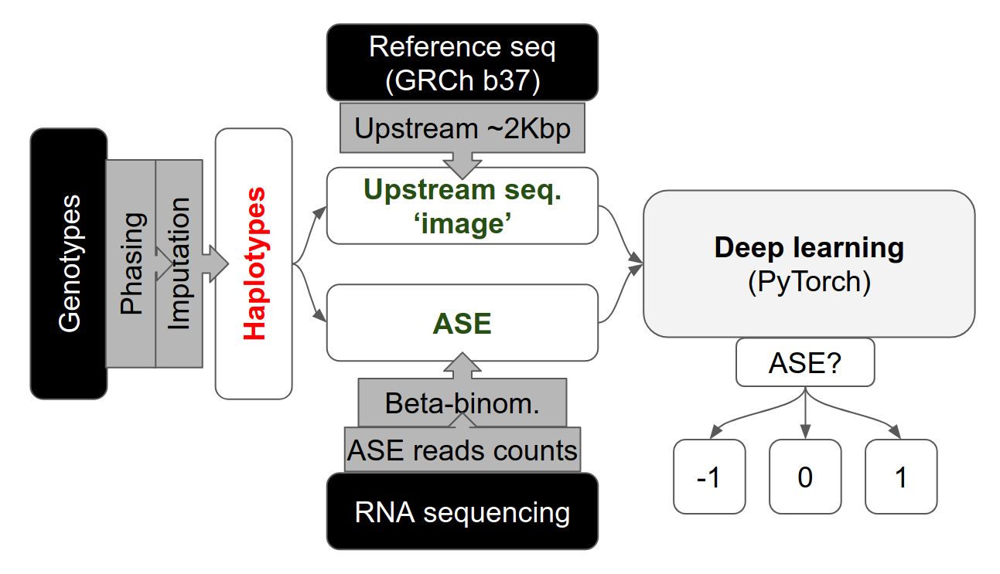

# Allele-specific expression Deep Learning Predictor

## Mapping reads to reference genome
- Quality control of raw reads was done using `fastp`
- Clean reads were mapped to reference genome using `STAR`
- `WASP` pipeline was used to smooth the allelic mapping bias
- `WASP` pipeline to count reads per haplotype

## Construct potential regulatory sequence matrix

## Quantify ASE effects from RNA seq results

## Train deep learning model using PyTorch

## Validate the deep learning model using GTEx dataset

## Directory tree
Current dir: `~/Documents/projects/wp_ase_dlp`

| Name      | Type                       | Function                                                         |
| :---      | :---                       | :---                                                             |
| README.md | Regular file or soft link  | This file itself, or a soft link to the README[.md] in scripts/. |
| inputs/   | Directory                  | Any files not produced during current project.                   |
| outputs/  | Directory                  | Final output that will be published or shared.                   |
| scripts/  | Directory                  | Any scripts use in current project                               |
| misc/     | Directory                  | Any files not grouped into other directories.                    |
| temps/    | Directory                  | Temporary files                                                  |


## Overview of dataset

### BIOS (UMCG clusters)

There are 6 cohort with genotypes and RNA-seq results available.

#### Genotypes (imputed by Michigan Imputation Server)

In total, there are 3,768 genotypes available (calculon: `/groups/umcg-bios/prm02/projects/HRC_imputation`).

For each cohort, there are

| Cohort       | Nr. samples |
| :----------- | :---------- |
| CODAM        | 561         |
| NTR_GoNL     | 333         |
| NTR_Aff6     | 1805        |
| PAN          | 192         |
| RS           | 877         |
| LLS_OminExpr | 236         |
| LLS_660Q     | 377         |
| LL           | 1134        |

**Note**:
1. LL are zipped archives.
2. Don't know the exact imputation settings yet.

#### RNA-seq (Calculon / Gearshift?)

The FASTQ files are not on Gearshift yet (2021 Feb 10), but could be found on Calculon at: `/groups/umcg-bios/prm02/rawdata/rnaseq`

#### After matching genotype ids to RNA-seq ids

More info at: `~/Documents/projects/wp_ase_dlp/inputs/idmapping`

| Cohort id    | Successful count  | Schedualed count  | Pass  |
| :----------- | :---------------- | :---------------- | :---- |
| CODAM        | 180               | 180               | Yes   |
| LLS_660Q     | 372               | 372               | Yes   |
| LLS_OminExpr | 236               | 236               | Yes   |
| NTR_Affy6    | 744               | 744               | Yes   |
| PAN          | 167               | 167               | Yes   |
| RS           | 698               | 698               | Yes   |
| gonl         | 273               | 273               | Yes   |
| LL           | 407               | 407               | Yes   |
| Total        | 3077              | 3077              | Yes   |

**Some issues:**  
1. The LL deep are note imputed by Michigan imputation server yet.


### Geuvadis

#### Genotypes

#### RNA-seq


### GTEx

We requested GTEx dataset (979 participants) by Project dbGap Accession Number: phs000424.v8.p2.c1

#### RNA-seq
We downloaded BAM files for 922 whole blood samples (Whole Blood: Whole Blood) using Gen3-Client following the instruction at [GTEx v8 free egress instructions](https://anvilproject.org/learn/reference/gtex-v8-free-egress-instructions).
We used the newest (9th Dec. 2020) Linux version of Gen3-Client downloaded from [GitHub](https://github.com/uc-cdis/cdis-data-client/releases/download/2020.12/dataclient_linux.zip)
The dataset includes 618 males (median age xxx) and 304 females (median age xxx)

#### Genotype


## Questions
### 1. What does the Inaccessible in the FILTER field mean?
SNPs in "inaccessible' genome region, the inaccessible regions are enriched for
novel SNVs; many are likely to be false positives.

### 2. How many individuals in GoNl cohort (only parents)
There are 499 individuals in total, 250 fathers, 248 mothers, 1 mothers (should
be excluded in the anlysis) with haplotypes inferred from the children.

### 3. How many individuals(only parents) both in GoNl and BIOS
There are 397 individuals, including 134 fathers, 134 mathers and 129 children.
**Therefore, we only have at most 268 samples to be analyzed.**
Questions could be that: is the sample size large enough?

### 4. Which reference genome was used in the GoNl project? By which aligner?
- Refrence genome: UCSC human reference genome build 37 (/home/cog/lfrancioli/resources/hg19/human_g1k_v37.fa).
- Aligner: BWA(0.5.9-r16)

### 5. Which reference genome, gene annotation information, and SNPs will be used?
- Reference genome: human_g1k_v37.fasta
- Gene annotation info: ensembl GRCh37 release-75
- Connonical SNPs: biallelic SNPs

### 6. How to eliminate the allelic mapping bias?
We have many options but we chose WASP to correct the allelic mapping bias.
Actually I had been hasitating between hard-mask [by Niek et al.] and WASP pipepline.
This [post](https://www.biostars.org/p/290455/) pushed me to choose the later. Referee to Lude's paper on an allelic expression analysis on GoNL and BIOS cohort.

### 7. How to compile `snp2h5 / fasta2h5` on cluster?

\textcolor{red}{Compile snp2h5 is only needed to be done if you plan use snp2h5 or fast2h5}

```bash
# 1. The following version of HDF5 functions in the compilation
$> module load HDF5/1.8.14-foss-2015b

# 2. Change `HDF_INSTALL=${HOME}/anoconda` to the path where HDF5 is installed

# 3. Optional
$> export LD_LIBRARY_PATH=$LD_LIBRARY_PATH:/apps/software/

# 4. make
$> cd snp2h5
$> make

# 5. Copy or move the complied binary snp2h5 to anywhere handy
```

### 8. How to quantify allelic expression

Currently, we used STAR + WASP + GATK/ASEReadCounter + in-house-script to estimate allelic expression.

### 9. Competitions

A paper using BIOS and GoNL cohort was published in this June (Lude is one of the authors).

### 10. Remove duplicated reads?

In the WASP pipeline, the duplicated reads will be removed by `rmdup_pe.py` or `rmdup.py` for paired-end or single-end reads.
But for RNA-seq experiments, is it reasonable to remove the duplicates?

### 11. Where the BIOS genotypes are?

Check the [BIOS on UMCG clusters](#Abstract)

### 12. Which genome should be used as reference panel?

If 1000KG reference was used, half of the variants will be discarded.
Would it be a choice to use GoNL?


# The Outline of the paper

## Prediction of allele-specific expression using RNA-seq results by deep learning

## Abstract

## Introduction

## Methods

### Phasing and haplotype

#### How the input files look like

#### Imputation and phasing

1. Imputated by Michigan Imputation Server
2. Phased by Beagle 5.1

#### Filter variants

1. Biallelic SNPs only
2. INFO/AF > 0.005 && INFO/AF <= 0.995 for GTEx and Geuvadis
3. INFO/MAF >= 0.005 && INFO/R2 >= 0.3

#### Liftover GRCh38 to GRCh37 (GTEx data only)

1. `CrossMap`
2. Reference genome: 1kg b37
3. Chain file: GRCh38_to_GRCh37.chain.gz

```bash
# CrossMap log
2021-04-24 02:12:14 [INFO]  Read the chain file "../../Ensembl_references/GRCh38_to_GRCh37.chain.gz"
2021-04-24 02:12:15 [INFO]  Keep variants [reference_allele == alternative_allele] ...
2021-04-24 02:12:16 [INFO]  Updating contig field ...
2021-04-24 02:12:16 [INFO]  Lifting over ...
2021-04-24 02:34:45 [INFO]  Total entries: 12298730
2021-04-24 02:34:45 [INFO]  Failed to map: 242682
```

### ASE quantification

#### Preprocessing and QC

`fastp` preprocessing

#### Reads mapping

`STAR` two-pass mapping

#### Remove reference bias

`WASP` pipeline to remove reference bias

#### Allelic read counts

`GATK/ASEReadCounter` to count allelic reads from the BAM files corrected by `WASP`.

#### Quantification of ASE

In-house scripts to construct regulating matrix and to estimate ASE effects  
    - Regulating sequence
    - ASE effects (estimated from the allelic reads count)

Please note:
    1. MHC (HLA) region was excluded.
    2. Current only SNPs should be included, because indels cause a different length of two allele.

### Deep learning model

`PyTorch` to implement a `CNN` model, using pre-constructed ResNext architechture with small modification.

1. ResNext architechture (the output layer has three classes)
2. Drop-out is an more convenient way to diminish over-fit


## Results

### Basic statistics

1. Merge P-values by beta-binomial test for each gene.
2. Adjust P-values of multiple-test by FDR.
3. Assign genes with FDR < 0.05 as ASE genes for the given individuals.
4. Stacked bar plot to show the percentage of gene with ASE. Perhaps, multiple plots with different FDR threshold are more expressive.
5. A Manhattan plot to show P-values across the genome per chromosome.
6. Gene enrichment in different gene sets. E.g. GO annotations, pathways.
7. A Venn plot (?) to show the overlaps across different cohorts.
8. Hetergenous genetic background leads to a reduced number of ASE genes.

### Model training and evaluation

#### Training

#### Evaluation

1. Accuracy
2. Precision
3. Recall
4. ROC-AUC curve

#### Class activation map (CAM)

A way to show important pixels which determine the class for a given input
matrix. It combines the last features map in forward propagation and fully
connected layers that includes classification information. The integration are
represented by heatmap in which the color emphasizes the importance of pixels
with respect to classification.

### Expanding target cohort from GoNL (268) to BIOS (~3000) + Geuvadis (400) + GTEx (800)

In the pilot study to predict ASE, the results demonstrated that features in
upstream sequence of a gene are reliable predictors to discriminate ASE from
non-ASE genes. However, there are risks that the CNN model could be over-fitted
as the small sample size (i.e. 268 samples). To minimize the over-fitting
issue, more samples will be exploited in the model.

### Data

#### GRCh37 reference

#### BIOS RNA-seq results and genotypes

#### Geuvadis RNA-seq and genotypes

#### GTEx allelic reads count and genotypes

#### Pre-process

Removing genes at MHC regions (GRCh37, chr6:28,477,797-33,448,354).


# Misc

## Flow of file suffix

```yaml
fastp:
    input:
        .raw.fq1.gz
        .raw.fq2.gz
    output:
        .clean.fq1.gz
        .clean.fq2.gz

STAR mapping:
    input:
        .clean.fq1.gz
        .clean.fq2.gz
    output:
        .bam

find_intersecting_snps.py:
    input:
        .bam
    output:
        .keep.bam
        .to.remap.bam
        .remap.fq1.gz
        .remap.fq2.gz
        .remap.single.fq.gz

STAR mapping:
    input:
        .remap.fq1.gz
        .remap.fq2.gz
    output:
        .remap.bam

filter_remapped_reads.py:
    input:
        .to.remap.bam
        .remap.bam
    output:
        .remap.keep.bam
    
SAMtools:
    input:
        .keep.bam
        .remap.keep.bam
    output:
        .keep.merged.bam
```


## 杂合的遗传背景造成共有ASE基因的减少?

BIOS里面一共有6个小的队列组成，每个队列的genotype都是独自做单倍型定相。
这降低了基因型插补后的SNP数量，间接降低了杂合位点的数量，从而导致ASE基因的数量也减少？
所以，我现在准备整合所有队列，然后一起做单倍型定相。
这样做会存在什么问题吗？


## Genotype座标转换

现在GTEx的版本是GRCh38，但BIOS的版本是GRCh37。所以需要把GTEx的数据做liftover。
准备用`CrossMap`，它支持多种文件格式，18年开始发布版本，目前更新频繁。
此外它是Assemble Converter在线版本的后端工具，有Ensembl为其背书，应该比较好用。
此外Ensembl还提供了相应的座标转换文件，本工作将使用该转换文件：
[here](ftp://ftp.ensembl.org/pub/assembly_mapping/homo_sapiens/GRCh38_to_GRCh37.chain.gz)

更多内容参见官网：http://crossmap.sourceforge.net


<!-- vim: set nospell: -->
